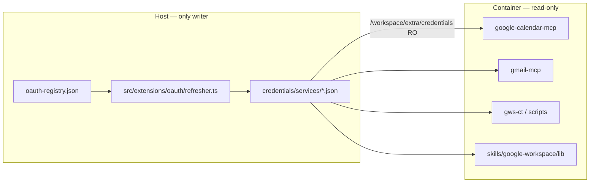

# Google Workspace — host OAuth runbook (Silas / Connected Tutors)

Replication guide for wiring a NanoClaw agent to Google Workspace using **host-managed OAuth** (not OneCLI). Written after the Silas integration (June 2026). Use this to copy the pattern to another agent or host.

**Related docs**

| Doc | Purpose |
|-----|---------|
| [oauth-hybrid-repair.md](oauth-hybrid-repair.md) | Host refresher, `ncl oauth-*`, invariants |
| [agent-owned-code.md](agent-owned-code.md) | Where agent/skills files live in git |
| `.claude/skills/add-google-workspace-host/SKILL.md` | Installable skill (step-by-step for operators) |
| `skills/google-workspace/SKILL.md` | Agent-facing skill (container paths, examples) |

---

## Hosts and users

Production runs on **one machine**, two Linux users:

| Alias | SSH user | Host | Agent | Primary group folder | Agent group id |
|-------|----------|------|-------|----------------------|----------------|
| `cleo` | `cian` | `cleo-lc.cognitivetech.net` | Cleo | `agents/cleo/groups/dm-with-cian/` | (Cleo primary) |
| `cleo-silas` / Silas | `christina` | `cleo-lc.cognitivetech.net` | Silas | `agents/silas/groups/dm-with-christina/` | `ag-1779225837260-j7xqo0` |

Repo on each server: `~/nanoclaw` (fork: `zenmindhacker/nanoclaw`).

**Cleo vs Silas (important):** Cleo often uses **OneCLI** for Google (`/add-gmail-tool`, `/add-gcal-tool` stub pattern). **Silas does not** — Connected Tutors Google uses **host OAuth files** mounted read-only. Do not point Silas at OneCLI connect URLs.

Deploy from dev:

```bash
# SSH aliases need ~/.ssh/config or .cursor/setup-ssh.sh (Cloud Agents)
scripts/deploy-remote.sh silas

# Or manually on server (as christina):
cd ~/nanoclaw && git pull --ff-only && pnpm install --frozen-lockfile && pnpm run build
./container/build.sh
systemctl --user restart nanoclaw
bash scripts/silas/wire-google-workspace.sh
```

---

## Architecture (two lanes, one token layer)



**Rules**

1. **Host owns tokens** — only the host refresher writes token JSON.
2. **Credentials mount is read-only** — prevents OpenCode from rewriting tokens as `{ "normal": { ... } }`.
3. **Registry id** maps to token + client filenames (multi-account).
4. **Gmail send policy** lives in agent instructions, not OAuth scopes.

---

## Google accounts (Silas)

| Registry id | Google account | Token file | Client file | Status on Silas |
|-------------|----------------|------------|-------------|-----------------|
| `shadow-google` | `hello@connectedtutors.org` | `shadow-google-token.json` | `shadow-google-oauth-client.json` | Live |
| `meridian-google` | `christina@meridian-institute.org` | `meridian-google-token.json` | `google-oauth-client.json` | Registry only until authed |

OAuth app (Connected Tutors): Google Cloud project `openclaw-access-487720` — test users must be added in Console if you see `403 access_denied`.

---

## Host-side files (not in git)

All under `~/.config/nanoclaw/` on the **target server user** (e.g. `christina@cleo-lc`):

| Path | Purpose |
|------|---------|
| `credentials/services/shadow-google-oauth-client.json` | OAuth client (installed app) |
| `credentials/services/shadow-google-token.json` | Access + refresh token |
| `credentials/services/oauth-registry.json` | Registry entries for host refresher |
| `credentials/services/google-oauth-client.json` | Meridian client (when used) |
| `credentials/services/meridian-google-token.json` | Meridian token (after auth) |
| `mount-allowlist.json` | `defaultMounts` entry: `credentials` → **read-only** |

**Container mount:** host `credentials/services/` → `/workspace/extra/credentials/` (flat filenames, no `services/` subdir in container).

Example registry entry (`shadow-google`):

```json
{
  "id": "shadow-google",
  "token_file": "shadow-google-token.json",
  "provider": "google",
  "token_url": "https://oauth2.googleapis.com/token",
  "client_file": "shadow-google-oauth-client.json",
  "auth_method": "client_secret_post",
  "account": "hello@connectedtutors.org",
  "org": "connected-tutors"
}
```

**Repair commands (host):**

```bash
pnpm run ncl oauth-health
pnpm run ncl oauth-refresh-one --id shadow-google
pnpm run ncl oauth-refresh-now
```

---

## Repo source files (copy these)

### Host OAuth hardening

| File | What it does |
|------|----------------|
| `src/extensions/oauth/refresher.ts` | Unwraps `{ normal: ... }` on load; saves flat token JSON |
| `src/extensions/oauth/refresher.test.ts` | Unit tests for token shape normalization |
| `.nanoclaw/oauth-hybrid-repair.md` | Operator doc for hybrid OAuth model |

### Container CLIs / MCP (image build)

| File | What it does |
|------|----------------|
| `container/cli-tools.json` | Pins `@cocal/google-calendar-mcp`, `@gongrzhe/server-gmail-autoauth-mcp`, `zod-to-json-schema`, `@googleworkspace/cli` |
| `container/install-cli-tools.sh` | Installs manifest via pnpm global |
| `src/google-workspace-cli-tools.test.ts` | Guard test for cli-tools pins |
| `src/gcal-cli-tools.test.ts` | Guard test for calendar MCP pin |

Current `cli-tools.json` entries:

```json
{ "name": "@cocal/google-calendar-mcp", "version": "2.6.1" },
{ "name": "@gongrzhe/server-gmail-autoauth-mcp", "version": "1.1.11" },
{ "name": "zod-to-json-schema", "version": "3.22.5" },
{ "name": "@googleworkspace/cli", "version": "0.22.5", "onlyBuilt": true }
```

Binaries in container: `google-calendar-mcp`, `gmail-mcp`, `gws`.

### Skills — deterministic lane (`skills/google-workspace/`)

Mounted in container as `/workspace/extra/skills/google-workspace/`.

| Path | Purpose |
|------|---------|
| `SKILL.md` | Agent/operator examples |
| `lib/registry.mjs` | Registry id → filenames |
| `lib/resolve-google-creds.mjs` | Resolve host/container paths (read-only) |
| `lib/access-token.mjs` | Return valid access token (trust host refresher) |
| `lib/normalize-token.mjs` | Unwrap OpenCode `normal` wrapper |
| `lib/build-gws-env.mjs` | Build env for `gws` CLI |
| `bin/gws-ct` | Wrapper for Connected Tutors (`shadow-google`) |
| `bin/gws-meridian` | Wrapper for Meridian (`meridian-google`) |
| `bin/send-email.mjs` | Gmail send via REST + host token |
| `scripts/auth-hello-meridian-google.mjs` | One-time OAuth for Meridian account |
| `docs/WORKSPACE-MCP-SPIKE.md` | Unified MCP evaluation (decision: defer) |

### Skills — auth scripts (existing)

| Path | Account | Output token |
|------|---------|--------------|
| `skills/transcript-sync/scripts/auth-hello-ct-calendar.mjs` | `hello@connectedtutors.org` | `shadow-google-token.json` |
| `skills/transcript-sync/scripts/auth-ctci-calendar.mjs` | (legacy CTCI naming) | same token path |

Full Workspace scopes in `auth-hello-ct-calendar.mjs`: Gmail, Calendar, Drive, Docs, Sheets, Slides, Contacts, Tasks.

Run on a machine with a browser (port 80 often needs `sudo`):

```bash
sudo node skills/transcript-sync/scripts/auth-hello-ct-calendar.mjs
# Meridian:
node skills/google-workspace/scripts/auth-hello-meridian-google.mjs
```

### Skills — shared consumers

| Path | Change |
|------|--------|
| `skills/invoice-generator/scripts/gmail-helpers.mjs` | Uses `google-workspace/lib/access-token.mjs` (no in-container refresh/write) |

### Agent instructions (Silas)

| Path | Content |
|------|---------|
| `agents/silas/groups/dm-with-christina/CLAUDE.local.md` | Host OAuth paths, MCP vs gws, Gmail send confirm policy |
| `agents/silas/groups/dm-with-christina/container.json` | **Generated from DB** — do not edit for MCP; use `ncl` |

### Install / wire scripts

| Path | Run where | Purpose |
|------|-----------|---------|
| `scripts/silas/wire-google-workspace.sh` | Silas host | RO credentials mount, register calendar+gmail MCP, meridian registry, flatten token, refresh |
| `scripts/silas/spike-workspace-mcp.sh` | Optional | Phase 2b spike only (not prod default) |
| `scripts/deploy-remote.sh silas` | Dev machine | git pull, build, restart, post-upgrade |

### Operator / install skills

| Path | Audience |
|------|----------|
| `.claude/skills/add-google-workspace-host/SKILL.md` | Human or agent installing on a new host |
| `skills/credentials/SKILL.md` | Three credential lanes (OneCLI vs host OAuth vs agent-editable) |

---

## MCP wiring (central DB, not container.json)

Persist via `ncl` on the **host** (group id for Silas DM: `ag-1779225837260-j7xqo0`):

**Calendar**

```bash
pnpm run ncl groups config add-mcp-server \
  --id ag-1779225837260-j7xqo0 \
  --name calendar \
  --command google-calendar-mcp \
  --args '[]' \
  --env '{"GOOGLE_OAUTH_CREDENTIALS":"/workspace/extra/credentials/shadow-google-oauth-client.json","GOOGLE_CALENDAR_MCP_TOKEN_PATH":"/workspace/extra/credentials/shadow-google-token.json"}'
```

**Gmail**

```bash
pnpm run ncl groups config add-mcp-server \
  --id ag-1779225837260-j7xqo0 \
  --name gmail \
  --command gmail-mcp \
  --args '[]' \
  --env '{"GMAIL_OAUTH_PATH":"/workspace/extra/credentials/shadow-google-oauth-client.json","GMAIL_CREDENTIALS_PATH":"/workspace/extra/credentials/shadow-google-token.json"}'
```

Agent tool names: `mcp__calendar__*`, `mcp__gmail__*`.

Or run the all-in-one script: `bash scripts/silas/wire-google-workspace.sh`.

---

## What to use when (Silas)

| Task | Agent | Script / CLI |
|------|-------|----------------|
| Calendar | `mcp__calendar__*` | `gws-ct calendar ...` (see gws caveat below) |
| Gmail search / draft / send | `mcp__gmail__*` (confirm before send) | `send-email.mjs` |
| Drive / Sheets / Docs | bash + `gws-ct` (interim) | `access-token.mjs` + REST or gws |
| Cron / batch | N/A | `skills/google-workspace/lib/access-token.mjs` |

---

## Replication checklist (for another agent)

Copy this order on a **new host user** or **new agent group**:

### 1. Repo (git)

- [ ] Merge/pull commits that include `skills/google-workspace/`, cli-tools changes, refresher hardening, wire script
- [ ] Tier 0: `pnpm run typecheck && pnpm test` (at minimum `src/extensions/oauth/refresher.test.ts`, `src/google-workspace-cli-tools.test.ts`)

### 2. Host credentials

- [ ] Copy or create OAuth client JSON in `~/.config/nanoclaw/credentials/services/`
- [ ] Run auth script; save token JSON
- [ ] Add entry to `oauth-registry.json`
- [ ] `pnpm run ncl oauth-refresh-one --id <registry-id>`

### 3. Mount security

- [ ] In `~/.config/nanoclaw/mount-allowlist.json`, set `defaultMounts` credentials entry `allowReadWrite: false`
- [ ] Restart nanoclaw after allowlist change

### 4. Container image

- [ ] `./container/build.sh` on server (required when `container/cli-tools.json` changes)
- [ ] `systemctl --user restart nanoclaw`

### 5. Group config (DB)

- [ ] Register `calendar` and `gmail` MCP servers with env paths under `/workspace/extra/credentials/`
- [ ] Update group `CLAUDE.local.md` (not generated `CLAUDE.md`)

### 6. Verify

```bash
pnpm run ncl oauth-health
pnpm run ncl groups config get --id <agent-group-id>
pnpm run post-upgrade -- --agent silas --tier 1,2 --json-out ~/upgrade-report.json
```

Smoke in chat: list calendars, search Gmail inbox.

---

## Known issues (as of deploy June 2026)

### 1. `gws` GLIBC on `node:22-slim`

`@googleworkspace/cli` ships a native binary requiring **GLIBC 2.39+**. `node:22-slim` on cleo-lc is older — `gws` and `gws-ct` fail in container.

**Workarounds until base image bump:**

- Use **`mcp__calendar__*`** and **`mcp__gmail__*`** for agent Google ops (working).
- Use **`access-token.mjs`** + Google REST from Node scripts (working).
- Run `gws` on the **host** (not container) if needed.

### 2. OAuth client file permissions

`shadow-google-oauth-client.json` is often `600` owned by the host user. Container runs as same uid via `--user` in `container-runner.ts` — ensure client file is readable by the nanoclaw user (container uid matches host uid).

### 3. OpenCode `normal` token wrapper

If calendar/Gmail break with absurd negative `expiresInMin`, flatten token:

```bash
# Host refresher now auto-unwraps; manual fix if needed:
node -e 'const fs=require("fs"),p=require("path"),h=require("os");const f=p.join(h.homedir(),".config/nanoclaw/credentials/services/shadow-google-token.json");const r=JSON.parse(fs.readFileSync(f));if(r.normal)fs.writeFileSync(f,JSON.stringify(r.normal,null,2)+"\n")'
pnpm run ncl oauth-refresh-one --id shadow-google
```

Root cause: writable credentials mount — fixed by RO mount + refresher hardening.

### 4. Meridian account

Registry entry exists; token file missing until `auth-hello-meridian-google.mjs` is run. Expected `oauth-health` error until then.

### 5. Tier 2 post-upgrade on Silas

`cli.ping` / `slack.synthetic` may fail independently of Google wiring — Tier 1 (30 checks) passed after this deploy.

---

## Git commits (reference)

| Commit | Summary |
|--------|---------|
| `8dcdaf60` | `feat(silas): host OAuth Google Workspace integration` |
| `249e258c` | `fix(silas): enable gws postinstall and fix wire script argv` |

---

## Copying to a different agent (e.g. second group or Cleo host-OAuth)

1. Pick a new **registry id** + token/client filenames (or reuse `shadow-google` if same account).
2. Reuse `skills/google-workspace/` — add registry entry in `lib/registry.mjs` if new id.
3. Register MCP servers on the **target agent group id** with the same env path pattern.
4. Add a `CLAUDE.local.md` section for that group (Gmail policy, repair commands).
5. Do **not** mix OneCLI stubs and real host tokens on the same MCP env vars.

For a **second Google account** on the same group: either second MCP server name (`gmail-meridian`) with meridian env paths, or separate agent group — see Phase 3 in the install skill.

---

## Explicit non-goals (this integration)

- OneCLI Google connect flows on Silas
- Google official remote HTTP MCP (stdio-only OpenCode adapter today)
- Unified Python `workspace-mcp` in production (spike deferred — see `skills/google-workspace/docs/WORKSPACE-MCP-SPIKE.md`)
- Changing Cleo's separate `google-gmail-token.json` layout on the Cleo host
