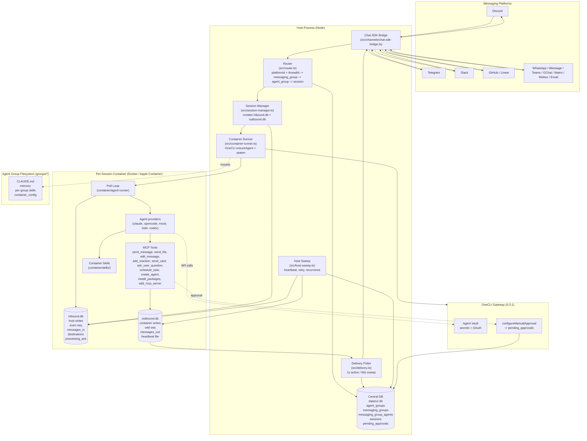
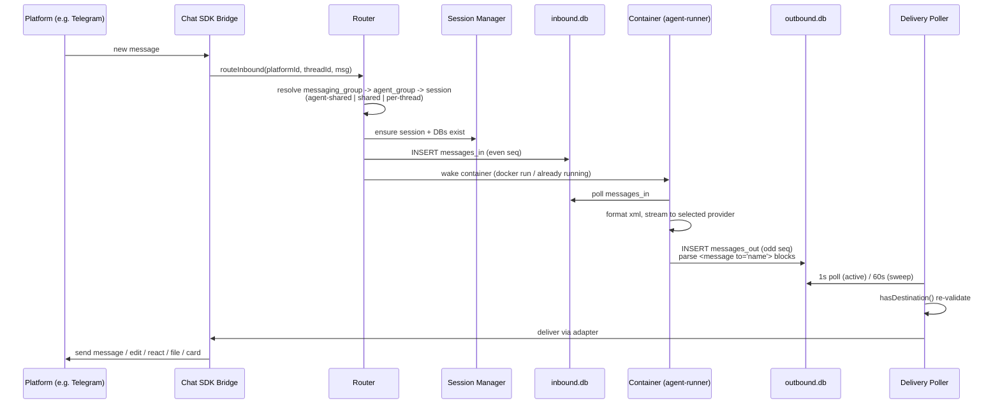
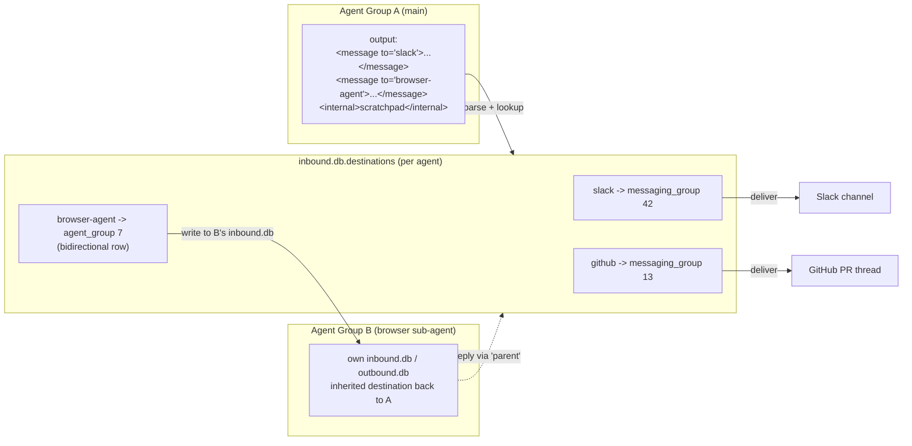
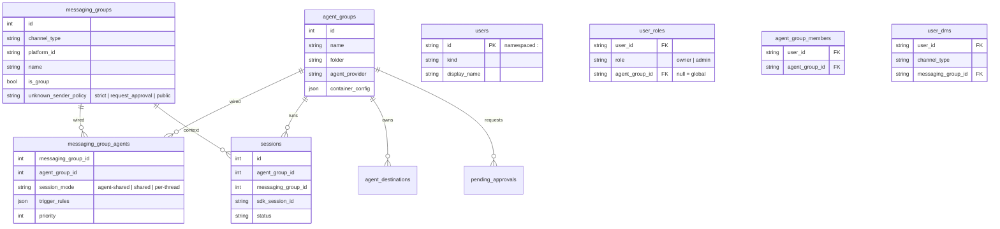
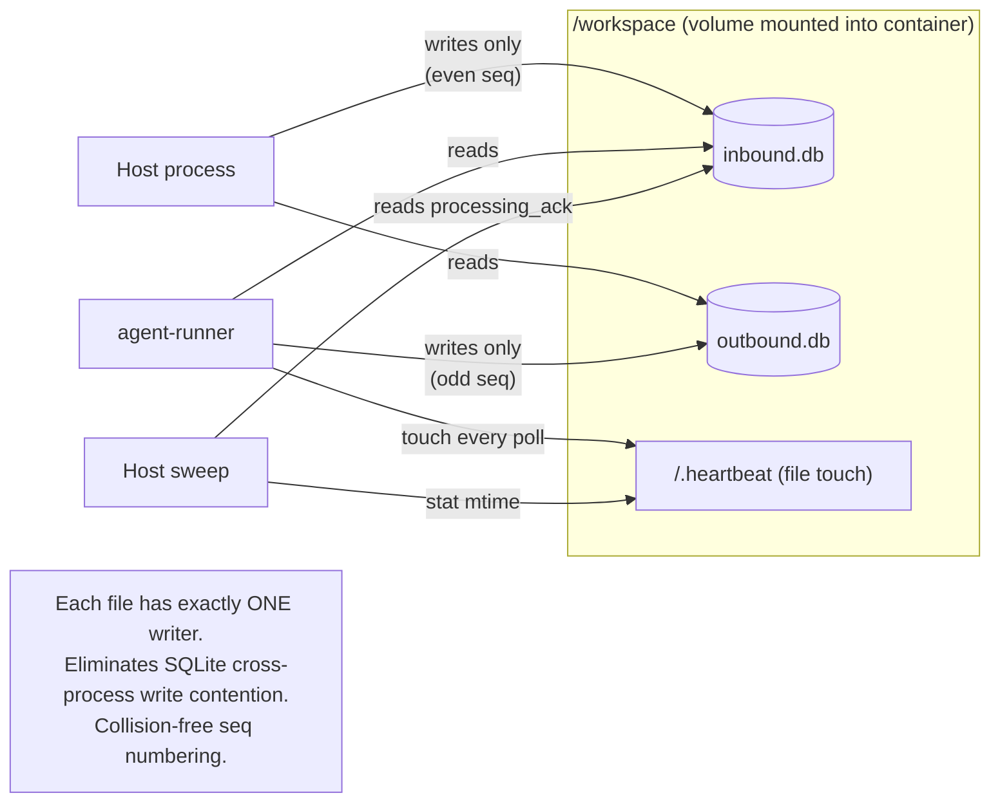

# NanoClaw Architecture Diagram

## System Overview

## Message Flow (inbound -> agent -> outbound)

## Named Destinations + Agent-to-Agent

## Entity Model + Isolation Levels

### Isolation Level Cheatsheet

| Level | `session_mode` | What's shared | Example |
|---|---|---|---|
| 1. Shared session | `agent-shared` | Workspace + memory + conversation | Slack + GitHub webhooks in one thread |
| 2. Same agent, separate sessions | `shared` / `per-thread` | Workspace + memory only | One agent across 3 Telegram chats |
| 3. Separate agent groups | (different `agent_group_id`) | Nothing | Personal vs work channels |

## Two-DB Split (why)

